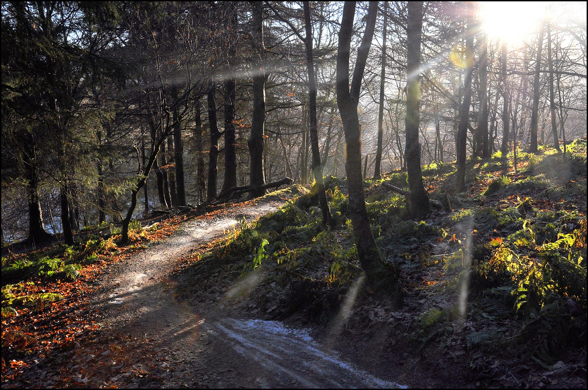

# Automagically dithering images with Hugo render hooks

You have no idea how frustrating it was to dither this single f\*\*\*ing image. 
But now the next whatever ones it will be will do that in _zero_ time.

I wanted that retro look I found in old manuals from the 60’s, but without the hassle of manually applying all these effects to each image I wanted to add. 

After quite a bit of research I found out that it is quite easy to do with a somewhat recent hugo update that introduced [dithering](https://gohugo.io/functions/images/dither/) as a native function.

Now, I _could_ keep the classic black and white default, but I opted for a binning palette of muted colors, which I handpicked to my personal liking. 

## The result:

Admittedly, it does not work too well on bright images, but it's not too bad for a full 16 colors (including black and white).

